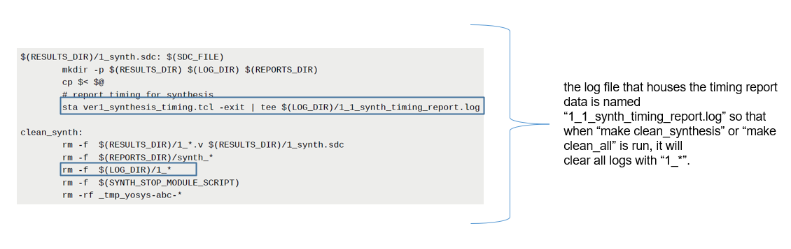
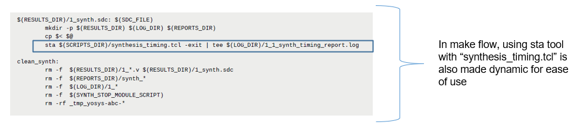

# OpenROAD Flow Improvement
This repository epitomizes report generation system for synthesis, check drc after final gds generation for 7nm **asap7** pdk and creating macro power via connection in riscv32i design for The OpenROAD 7nm Physical Design Contest.

&nbsp;

## Table of Contents
1. [Limitation of OpenROAD Synthesis flow](https://github.com/Fahim36201/OpenROAD-flow-scripts/tree/7nmcontest#1-limitation-of-openroad-synthesis-flow)
 - 1.a. [Synthesis report generation flow](https://github.com/Fahim36201/OpenROAD-flow-scripts/tree/7nmcontest#1a-synthesis-report-generation-flow)
 - 1.b. [Evolution of the proposed Synthesis Flow
](https://github.com/Fahim36201/OpenROAD-flow-scripts/tree/7nmcontest#1b-evolution-of-the-proposed-synthesis-flow)
     - 1.b.1. [Version 1](https://github.com/Fahim36201/OpenROAD-flow-scripts/tree/7nmcontest#1b1-version-1)
     - 1.b.2. [Version 2](https://github.com/Fahim36201/OpenROAD-flow-scripts/tree/7nmcontest#1b2-version-2)
     - 1.b.3. [Version 3](https://github.com/Fahim36201/OpenROAD-flow-scripts/tree/7nmcontest#1b3-version-3)
 - 1.c. [Final Output](https://github.com/Fahim36201/OpenROAD-flow-scripts/tree/7nmcontest#1c-final-output)
2. [Limitation of DRC check options](https://github.com/Fahim36201/OpenROAD-flow-scripts/tree/7nmcontest#2-limitation-of-drc-check-options)
 - 2.a. [Challenges](https://github.com/Fahim36201/OpenROAD-flow-scripts/tree/7nmcontest#2a-challenges)
 - 2.b. [Observation](https://github.com/Fahim36201/OpenROAD-flow-scripts/tree/7nmcontest#2b-observation)
 - 2.c. [Installing Klayout](https://github.com/Fahim36201/OpenROAD-flow-scripts/tree/7nmcontest#2c-installing-klayout)
 - 2.d. [Work done to resolve this issue](https://github.com/Fahim36201/OpenROAD-flow-scripts/tree/7nmcontest#2d-work-done-to-resolve-this-issue)
 - 2.e. [Flow for generating drc reports](https://github.com/Fahim36201/OpenROAD-flow-scripts/tree/7nmcontest#2e-flow-for-generating-drc-reports)
 - 2.f. [DRCs in Klayout](https://github.com/Fahim36201/OpenROAD-flow-scripts/tree/7nmcontest#2f-drcs-in-klayout)
3. [Lack of Power grid connection to Macro](https://github.com/Fahim36201/OpenROAD-flow-scripts/tree/7nmcontest#3-lack-of-power-grid-connection-to-macro)
 - 3.a. [Challenges](https://github.com/Fahim36201/OpenROAD-flow-scripts/tree/7nmcontest#3a-challenges)
 - 3.b. [Observation](https://github.com/Fahim36201/OpenROAD-flow-scripts/tree/7nmcontest#3b-observation)
 - 3.c. [Work done to resolve this issue](https://github.com/Fahim36201/OpenROAD-flow-scripts/tree/7nmcontest#3c-work-done-to-resolve-this-issue)
4. [Conclusion](https://github.com/Fahim36201/OpenROAD-flow-scripts/tree/7nmcontest#4-conclusion)
5. [Author](https://github.com/Fahim36201/OpenROAD-flow-scripts/tree/7nmcontest#5-Author)
6. [Acknowledgement](https://github.com/Fahim36201/OpenROAD-flow-scripts/tree/7nmcontest#6-Acknowledgement)
&nbsp;

## 1. Limitation of OpenROAD Synthesis flow

Most EDA tools that perform synthesis does the following:

* Provides essential reports to check power, timing etc.
* Allowing the designer to get an early estimate about the feasibility of the design.
* However, the OpenROAD flow lacked this feature.
* The task was to explore how to add these necessary checks after synthesizing a design and generate timing reorts sucessfully.


&nbsp;

### 1.a. Synthesis report generation flow


&nbsp;

### 1.b Evolution of the proposed Synthesis Flow

&nbsp;

#### 1.b.1 Version 1
Objective: Secure the success of the implemenatation.

Assesment:

* Using the OpenSTA tool to load the verilog(.v) and generated sdc(.sdc) file using the synthesis tool Yosys.
* Perform timing and power checks using OpenSTA.

Shortcomings:

* This script was hardcoded and used just to get a feasibility of the idea.

Scripts:
````
flow/ver1_synthesis_timing.tcl
flow/scripts/report_metrics_synthesis.tcl
````
After synthesis generate reports using:

````
# form flow directory
source ../setup_env.sh
sta
source ver1_synthesis_timing.tcl
````
Script description:

* `flow/scripts/ver1_synthesis_timing.tcl` used in this version:


* `flow/scripts/report_metrics_synthesis.tcl` which was modified to work with **OpenSTA**:


&nbsp;

#### 1.b.2 Version 2
Objective: Integrating the modifications of `report_metrics_synthesis.tcl` into `report_metrics.tcl` and integrating this synthesis report generation to the flow.

Assesment:

* Using the built in modified `report_metrics.tcl` with `ver1_synthesis_timing.tcl`.
* Added the report generation process to OpenROAD Flow Scripts(ORFS).

Shortcomings:
* `ver1_synthesis_timing` was used which is hardcoded. also modifications to flow `Makefile` were not completely dynamic.
* Also for local machine there was an issue with OpenSTA tool not being setup through flow. sourcing `setup_env.sh` elevate this problem. This was not an issue for cloud machine.

Scripts:
````
flow/ver1_synthesis_timing.tcl
flow/scripts/report_metrics.tcl
````
In `Makefile` just before the step **clean_synth:** below portion was added to generate reports just after completion of syntheis.
````
sta ver1_synthesis_timing.tcl -exit | tee $(LOG_DIR)/1_1_synth_timing_report.log
````
report is generated after synthesis by:
````
# form flow directory
source ../setup_env.sh
Make synth
````
Script description:

* `flow/scripts/report_metrics.tcl` modifications to ensure it works for all physical design stages:


* `flow/Makefile` modifications done to ensure synthesis report are generated through make flow:



&nbsp;

#### 1.b.3 Version 3

Objective: Creating a dynamic `synthesis_timing.tcl` along with the modifications made in `Makefile` so that, it can be used for any designs. Also, add **Group Path** option to `report_metrics.tcl`.

Assesment:

* Ensuring that the whole proposed flow was dynamic along with the scripts used.
* Adding **Group Path** option to `report_metrics.tcl`. This was helpful to check timing paths based on group which is useful when debugging certain paths for causes of timing violation. A switch `USE_GROUP_PATH` has been added to `flow/designs/asap7/<DESIGN_NICKNAME>/config.mk` which needs to be set to **true** if you want to report timing paths according to path groups.
````
export USE_GROUP_PATH = true
````

Scripts:
````
flow/scripts/synthesis_timing.tcl
flow/scripts/report_metrics.tcl
````
In `Makefile` the portion introduced in version 2 is made dynamic:
````
sta $(SCRIPTS_DIR)/synthesis_timing.tcl -exit | tee $(LOG_DIR)/1_1_synth_timing_report.log
````
To solve  local machine there was an issue with OpenSTA tool described in version 2, following is added to local `.bashrc`
````
source_tool=$(find /home/fahim/ -name setup_env.sh) >/dev/null
source $source_tool >/dev/null
````
Script description:

* `flow/scripts/synthesis_timing.tcl` used to generate timing reports for synthesis stage in this version:


* `flow/Makefile` modifications to include the new `synthesis_timing.tcl and also remove hardcoded locations:
 


* `~/.bashrc` modifications for local machine:


* `flow/scripts/report_metrics.tcl` modifications to include path groups. `USE_GROUP_PATH` included in `flow/designs/asap7/<DESIGN_NICKNAME>/config.mk` switch needs to be toggled on:


&nbsp;

### 1.c Final Output

Using the modifications and scripts mentioned in version 3, all the desired results was acheived in log file `1_1_synth_timing_report.log`.


timing reports following path groups in log file after synthesis.


power reports generated after synthesis.


&nbsp;

## 2. Limitation of DRC check options

&nbsp;

### 2.a. Challenges
* In the OpenROAD flow, DRC checks work on **nangate45** and **sky130hd** with `make drc` command. 
* But for asap7, There was no rule file ( `.lydrc` ) to run DRC checks with.
* `.lydrc` file works for Klayout version 0.27.1 or higher

&nbsp;

### 2.b. Observation

* The following files are necessary to perform drc check with **klayout** using `make drc`:
````
6_final.gds
$(PLATFORM).lydrc
````
* Here `.lydrc` file was missing from **asap7** pdk.

&nbsp;

### 2.c. Installing Klayout

The `.lydrc` file can only be used with `0.27.1` or above.

Now, to install klayout:

* First, to download klayout use the [link](https://www.klayout.de/build.html).

* Then, install klayout. Here, version `0.28.5` was downloaded and installed.
````
sudo apt install <realpath of the downloaded klayout_0.28.5-1_amd64.deb>
````

&nbsp;

### 2.d. Work done to resolve this issue

To add drc support for **asap7** pdk and run `make drc`:
* First, ensure that a KLayout tech file (`.lydrc`) exists for the platform. If not, you can download a community-contributed KLayout enablement from this github [post](https://github.com/laurentc2/ASAP7_for_KLayout) by [**laurentc2**](https://github.com/laurentc2). This source was also suggested by the community when another user [**its-rakib**](https://github.com/its-rakib) raised the same [issue](https://github.com/The-OpenROAD-Project/OpenROAD-flow-scripts/discussions/850).


* Secondly, Create (or copy) the KLayout .lydrc file at 
`flow/platforms/$(PLATFORM)/drc/$(PLATFORM).lydrc`

* Add the following line at the end of `flow/platforms/$(PLATFORM)/config.mk:`
````
# KLayout DRC ruledeck
export KLAYOUT_DRC_FILE = $(PLATFORM_DIR)/drc/asap7.lydrc
````

&nbsp;

### 2.e. Flow for generating drc reports


&nbsp;

### 2.f. DRCs in Klayout
* The output files gennerated from `make drc`:
````
6_drc.log
6_drc_count.rpt
6_drc.lyrdb
````
* Using `6_drc.lyrdb` and `6_final.gds` we can explore drc violations in the design using **klayout**. A snippet of of **riscv32i** loaded in **klayout** after gds dump.


&nbsp;

## 3. Lack of Power grid connection to Macro

&nbsp;

### 3.a. Challenges
* In the OpenROAD flow, for **riscv32i** design with **asap7** pdk, macros were placed but they lacked connection to the design power grid.

&nbsp;

### 3.b. Observation
* Analyzing the issue revealed that power stripes for both VDD and VSS at M5 were present above macros but they lacked via connection to macros power grid which is at M4.


&nbsp;

### 3.c. Work done to resolve this issue
To establish power connection to macros, vias are dropped from M5 to M4.
* This modification is added to the end of existing powergrid generating script `flow/platforms/asap7/openRoad/pdn/grid_strategy-M2-M5-M7.tcl`:
````
#####################################
# macro via connection
#####################################
define_pdn_grid -name {core_macro} -voltage_domains {CORE} -macro -orient {R0 R180 MX MY} -halo {2.0 2.0 2.0 2.0} -default -grid_over_boundary
add_pdn_connect -grid {core_macro} -layers {M4 M5}
````
* This successfully establishing power connection to macros. Power via form M5 to M4 was generated connecting power stripe to macros.


&nbsp;

## 4. Conclusion

All the modifications proposed so far have been summed up below.

| Base Flow  | Modified Flow |
| ------------- | ------------- |
| 1. In the base flow, timing and Power reports are not available after synthesis. | 1. Using the proposed modifacations Timing and Power reports can be generated after synthesis. |
| 2. The base flow also doesn't report timing paths based on their path groups. | 2. The proposed modifications also report timing paths based on path groups in log file which is helpful during debugging.  |
| 3. After postroute, DRC checking was not possible using **asap7** pdk. | 3. After including the necessary files and modifications, DRC check is now possible using the **asap7** pdk after completing the RTL to GDS flow.  |
| 4. Power via connection is not established for macros in **riscv32i** design.  | 4. Power via connection to macros were established for **riscv32i** design using the suggested modifications.  |

**Note:** 
* After cloning the repository, you may need to source the `setup.env.sh` file.

&nbsp;

## 5. Author
**Fahim Faisal**, Physical Design Engineer, fahim.faisal@neural-semiconductor.com    
Physical Design Department    
[Neural Semiconductor Limited](http://www.neural-semiconductor.com/)    
Dhaka, Bangladesh

&nbsp;

## 6. Acknowledgement
* Neural Semiconductor Limited.
* Neural Semiconductor Physical Design Team.
